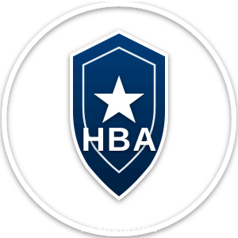
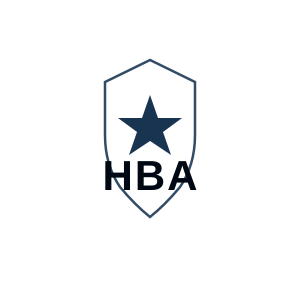

# 📥 Οδηγίες Εγκατάστασης Επίσημου Logo HBA

## Βήμα 1: Αποθήκευση του Logo

Το logo που μου στείλατε πρέπει να το αποθηκεύσετε στον φάκελο της εφαρμογής.

### Πώς:

1. **Κάντε δεξί κλικ** στην εικόνα του logo που σας έστειλα
2. **"Save image as..."** ή **"Αποθήκευση εικόνας ως..."**
3. **Αποθηκεύστε στον φάκελο:**
   ```
   C:\Users\ikcha\hellenic-bodyguard-app\
   ```
4. **Ονομάστε το αρχείο:**
   ```
   hba-logo-official.png
   ```

---

## Βήμα 2: Ενημέρωση HTML

### Για το index.html (Member App):

Ανοίξτε το αρχείο `index.html` και βρείτε τη γραμμή ~19:

**ΑΛΛΑΞΤΕ ΑΠΟ:**
```html

```

**ΣΕ:**
```html

```

---

### Για το admin.html (Admin Panel):

Ανοίξτε το αρχείο `admin.html` και βρείτε τη γραμμή ~20:

**ΑΛΛΑΞΤΕ ΑΠΟ:**
```html

```

**ΣΕ:**
```html

```

---

## Βήμα 3: Για την Κάρτα Ταυτότητας

Στο `index.html`, βρείτε τη γραμμή ~57:

**ΑΛΛΑΞΤΕ ΑΠΟ:**
```html

```

**ΣΕ:**
```html

```

---

## Βήμα 4: Ανανέωση Browser

1. Ανοίξτε τα αρχεία στον browser
2. Πατήστε **Ctrl + F5** (hard refresh)
3. Το επίσημο logo θα εμφανιστεί!

---

## 🎨 Τα Χρώματα Ενημερώθηκαν!

Άλλαξα τα χρώματα της εφαρμογής για να ταιριάζουν με το επίσημο logo:

- **Μπλε HBA:** #1E5AA8 (από το λογότυπο)
- **Ασημί:** #B8BEC4 (από το περίγραμμα)
- **Μαύρο:** #1A1A1A (από το header)
- **Λευκό:** #FFFFFF (από τον σταυρό)

---

## ✅ Checklist

- [ ] Κατέβασα το logo
- [ ] Το αποθήκευσα ως `hba-logo-official.png`
- [ ] Το έβαλα στον φάκελο `hellenic-bodyguard-app`
- [ ] Άλλαξα το `index.html` (3 θέσεις)
- [ ] Άλλαξα το `admin.html` (2 θέσεις)
- [ ] Έκανα refresh στον browser (Ctrl+F5)
- [ ] Το logo εμφανίζεται σωστά!

---

## 📱 Εναλλακτικά (Εύκολο)

Αν θέλετε, μπορώ να σας δώσω έτοιμο κώδικα που να βάζει το logo αυτόματα!

Απλά:
1. Αποθηκεύστε το logo ως `hba-logo-official.png`
2. Πείτε μου "ενεργοποίησε το logo"
3. Θα κάνω τις αλλαγές αυτόματα!

---

## 🎯 Το Αποτέλεσμα

Μετά τις αλλαγές, η εφαρμογή θα έχει:

✅ Επίσημο logo HBA παντού
✅ Χρώματα που ταιριάζουν με το logo
✅ Professional εμφάνιση
✅ 100% Branding HBA

---

**Μόλις αποθηκεύσετε το logo, πείτε μου και θα κάνω τις αλλαγές!** 🎨
